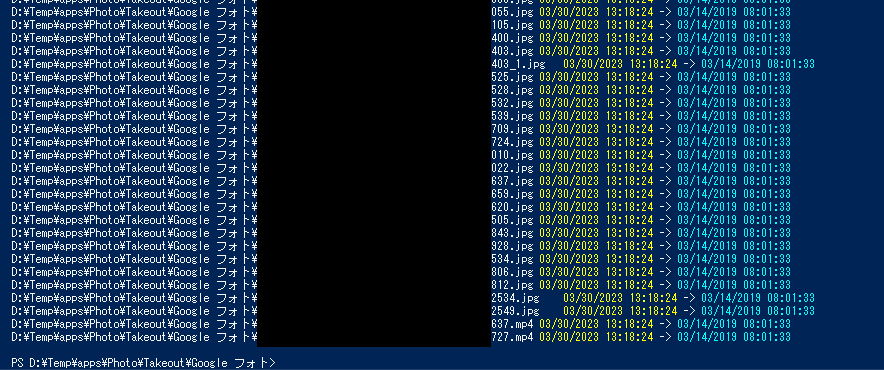

# PhotoAdjustor
Googleフォトでバックアップデータについて、画像ファイルの作成日時・更新日時を当時のものに戻すスクリプト

## 使い方
1. スクリプトを読み込みます。
2. バックアップした画像ファイルのデータがあるフォルダに移動します。
3. `GPhoto-Adjust`コマンドレットを実行します。

```cmd
. ./Adjustor.ps1
cd C:\Photo
GPhoto-Adjust
```

再帰的にすべての画像ファイルが読み込まれ、作成日時と更新日時が変更されます。



### オプションについて
`-HideDetails`オプションを指定するとファイル名や日時をコンソールに表示しなくなり、動作が早くなります。
